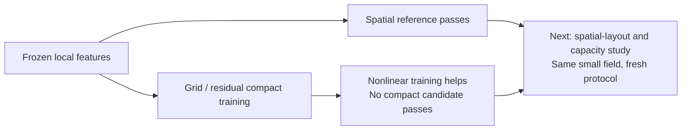

# Compact reconstruction assessment

Issue #397 / PR #398. Disposition: retain; no usable compact encoder and no promotion.
Run `compact-reconstruction-v1-run1`, source `4723679`, manifest `24902ee`.
Governing specification:
[specs#70](https://github.com/amadou-6e/specs/blob/73718860fd1e02842ed8c711e606f2b9c594f345/projects/theseo-anysearch/python/perception-encoder-compact-reconstruction.md).
Report payload SHA256:
`5ca3268a17847dde3bd30e6e019d48994f7140752d113bc1162ffeb594318474`.

## Results

All eight encoder fits, eight independent frozen-code head fits, spatial reference
and null control completed. Input33/central17, fresh density-balanced geometry,
frozen pretrained spatial backbone, identical4096-update fit budgets. Selection
metrics below are pooled for readability; the preregistered ranking is family-aware.

| ID | Aggregation | Code | Training decoder | IoU | Boundary F1 | Clearance | Recovery |
| --- | --- | ---: | --- | ---: | ---: | ---: | ---: |
| 0 | Grid | 64 | Linear | .1750 | .2503 | .1557 | .1558 |
| 1 | Grid | 64 | Conv | .2785 | .3565 | .0885 | .0885 |
| 2 | Grid | 128 | Linear | .1802 | .2638 | .1504 | .1504 |
| 3 | Grid | 128 | Conv | .2752 | .3537 | .0874 | .0872 |
| 4 | Residual | 64 | Linear | .2817 | .3612 | .0873 | .0873 |
| 5 | Residual | 64 | Conv | .3269 | .4039 | .0790 | .0790 |
| 6 | Residual | 128 | Linear | .2914 | .3727 | .0838 | .0837 |
| 7 | Residual | 128 | Conv | .3244 | .3971 | .0800 | .0800 |

Residual/conv has the highest pooled scores, **not** the selected architecture.
Its thin-sheet IoU is .1793/.1671 for64/128 codes, versus grid/conv .2048/.2095.
The frozen worst-family rule correctly selects **ID3**, then ID1. Neither passes
the binary task targets. Do not relabel ID5 as the winner based on pooled scores.

| Locked development model | IoU | Boundary F1 | Clearance | Recovery |
| --- | ---: | ---: | ---: | ---: |
| Selected grid128/conv, ID3 | .27136 | .35488 | .08829 | .08851 |
| Grid64/conv, ID1 | .27115 | .35161 | .08922 | .08927 |
| Uncompressed spatial reference | .75816 | .79214 | .04754 | .04832 |

The spatial reference passes IoU.60/F1.70/error.10 in every development family.
The selected compact model also exceeds .10 distance error in sphere/box families,
despite passing pooled distance scores. Null selection F1 is .25346. Grid/linear
codes are near null, with variance entropy ranks1.64/1.07; grid/conv ranks11.84/14.82,
residual/conv27.75/32.60. Entropy rank is a variance diagnostic, not information bits
or proof that all lower-variance directions are useless.

## Assessment and next action

The frozen local features support the task; these compact aggregation recipes do
not retain enough usable geometry. Nonlinear reconstruction improves over linear
training, but higher pooled scores and larger variance rank are insufficient.
Doubling64 to128 did not rescue the worst-family weakness. This is not a proof that
all compact representations or all learning rates are inadequate.

Next: a fresh spatial-layout/capacity and learning-rate study. Preserve ordered
local structure inside a flattened vector, compare spatial resolutions and channel
budgets, and retain the actual selected grid/conv recipe as a control. Explicitly
preregister any larger code sizes while keeping input33/target17 fixed. Use more
independent training geometries within a bounded feature-cache footprint, fresh
independent heads, unchanged targets and the same family-aware ranking. No more
head-only search on these fixed codes, no field enlargement and no qualification.

## Verification and budget

498 garden tests pass. All97 artifact hashes, eight original-backbone batch replays,
all eight probe/selection vector extractions, trained and independent decoder
predictions, shuffle checks, both controls and all three development predictions
replayed on original CUDA. Cache storage21,638,098,944 bytes remains outside Git,
along with weights and raw stores. Source verifier: `scripts/verify_compact_reconstruction.py`.

Report runtime3136.516s; ledger settlement3136.531s, including preparation and300s
initial overhead reserve. An additional300s post-run validation reserve is charged
in the campaign ledger, not retrospectively inserted into the immutable report.
No processes remain from this run. The approved48-hour campaign continues; no
integration merge or promotion was performed.
