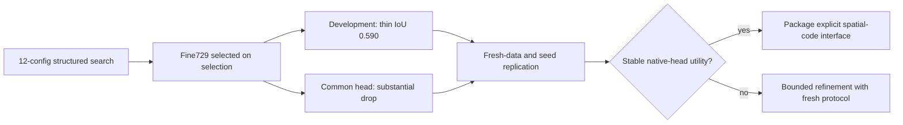

# Structured compact-code search assessment

Issue #399 / PR #400. Frozen spec
`02ab2379655e8a76ae4a6a6f3dc4ff483a74145a`; source
`07b24adce7a3faf15ab39bf81cd0a8e77822ed5e`.
Run `compact-structured-v1-run1` completed all 30 fits, 12 configurations and
279 hashed artifacts. Report payload:
`f4c46fe17c0c767e7e43e374ee940f70d83d760f472c18c1fd84a5ee02711b94`.
Full metrics and artifact hashes: [report](perception-encoder-local-geometry/compact-structured-report.json).

## Decision

Retain the structured fine-grid direction; do not qualify or promote this run.
The frozen ranking selected candidate 8 (9-cubed, one channel, 729 numbers,
LR 0.0003), with candidate 9 (same layout, LR 0.001) second. Both passed every
family target on selection. The selected candidate narrowly missed development
thin-sheet IoU (0.589664 < 0.60). Candidate 9 passed development targets, but
switching to it on development evidence would violate the selection lock.

## Selection screen

Pooled scores below are diagnostic; the actual ranking uses macro target count
then worst task/family ratio. All errors are normalized; lower is better.

| ID | Layout / dimension | LR | IoU | Boundary F1 | Clearance | Recovery |
| ---: | --- | ---: | ---: | ---: | ---: | ---: |
| 0 | coarse / 125 | .0003 | .50725 | .56307 | .04857 | .04838 |
| 1 | coarse / 125 | .001 | .51854 | .57411 | .04818 | .04800 |
| 2 | coarse / 250 | .0003 | .60665 | .64954 | .04177 | .04169 |
| 3 | coarse / 250 | .001 | .63406 | .67883 | .04157 | .04151 |
| 4 | coarse / 500 | .0003 | .69079 | .72654 | .04259 | .04249 |
| 5 | coarse / 500 | .001 | .70922 | .74966 | .04254 | .04247 |
| 6 | coarse / 1000 | .0003 | .73634 | .76791 | .04084 | .04072 |
| 7 | coarse / 1000 | .001 | .75764 | .79240 | .03969 | .03964 |
| 8 | fine / 729 | .0003 | .75932 | .78104 | .04492 | .04491 |
| 9 | fine / 729 | .001 | .75242 | .77348 | .05421 | .05409 |
| 10 | previous grid / 128 | .0003 | .19445 | .27424 | .13910 | .13904 |
| 11 | previous grid / 128 | .001 | .18797 | .27523 | .13892 | .13897 |

Coarse thin-sheet IoU improves from .20684 (125/.0003) to .58478 (1000/.001),
but no coarse candidate passes all family targets. Fine candidate 8 reaches
.60785 thin-sheet IoU and .75874 thin-sheet F1 on selection. Its narrowest
selection margin is random-field F1 (.70731 against .70).

## Locked development results

| Encoder / head | IoU | F1 | Clearance | Recovery | Family outcome |
| --- | ---: | ---: | ---: | ---: | --- |
| Selected 8 / native | .75263 | .77775 | .04506 | .04519 | thin-sheet IoU .58966 fails |
| Selected 8 / common | .56767 | .62079 | .04912 | .04925 | multiple binary targets fail |
| Runner-up 9 / native | .74653 | .77194 | .05413 | .05424 | all point targets pass |
| Runner-up 9 / common | .56095 | .60958 | .07767 | .07760 | multiple binary targets fail |
| Spatial reference | .75479 | .79716 | .04027 | .04146 | all point targets pass |

The common head cannot change selection. Its large drop limits readout generality:
the supported direction is a spatially structured vector with a layout-aware head,
not an interchangeable semantic global embedding. Every candidate head receives
only the vector and query indices, not raw input or local backbone features.

## Limits and next experiment

- One training seed and synthetic generator; no multi-seed qualification or planning claim.
- Native head capacities differ. Layout, capacity and decoder inductive bias are
  not isolated by cross-layout comparisons. Learning-rate pairs are matched within layout.
- Fresh corpus has more independent parents and fewer masks per parent than #397;
  query exposure also increased. Cross-study gains are not pure architecture effects.
- Spatial reference fails selection thin-sheet IoU (.57844), but passes development
  (.61573). Near-threshold point estimates need confirmation, not rounding or bar changes.
- No development-based reselection. Preserve candidate 8 as the selected recipe.

Next: a preregistered fresh-data, fresh-seed replication of the selected fine729
recipe with its native independent head and spatial/null controls. Keep the field,
architecture, optimization and targets fixed. Assess seed/family stability before
packaging; a repeatable deficit directs a separate bounded refinement, not retuning
on this development set. Common-head results remain a declared utility limitation.

## Validation and compute

514 garden tests passed before execution. Original-CUDA replay verified all 279
artifact hashes, eight backbone batches, 12 candidates, four controls, two common
heads and five development predictions with unchanged strict tolerances.
Immutable report runtime is 18,684.031 seconds (5.190 hours), including the frozen
900-second overhead reserve and timed preparation, below the eight-hour tranche.
No model weights or corpora are committed. No PR merge or promotion is authorized.
