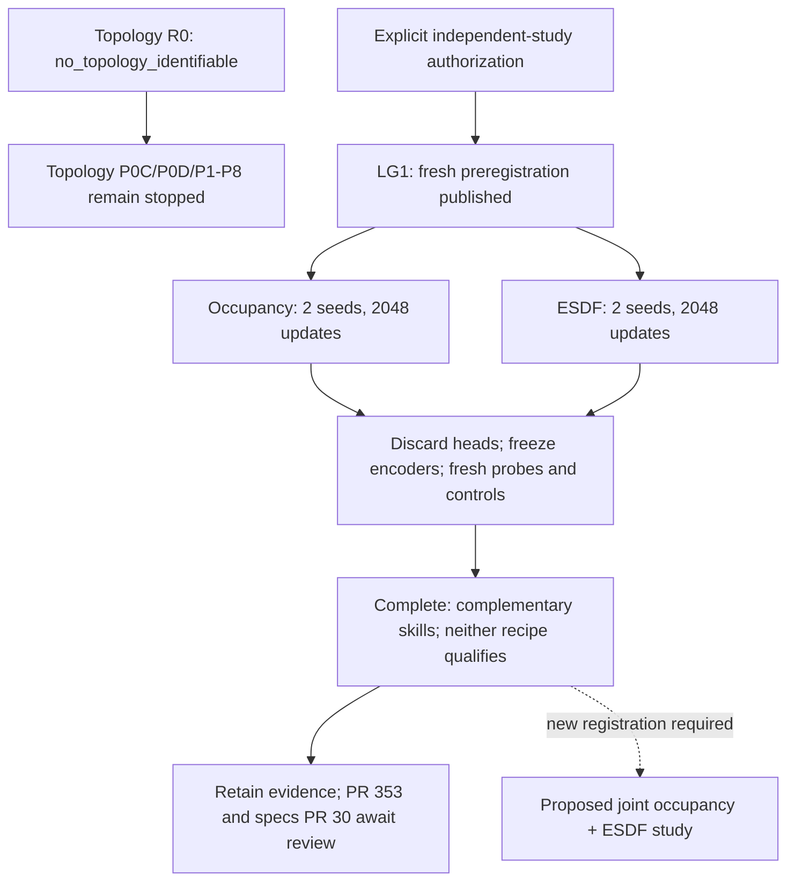

# LG1: completed local-geometry encoder comparison

Issue [#341](https://github.com/amadou-6e/theseo-anysearch/issues/341),
PR [#353](https://github.com/amadou-6e/theseo-anysearch/pull/353).
Disposition: **retain** the experiment, implementation and evidence on the
experimental line; **do not promote or certify either recipe**.

## Result

Four actual CUDA encoder-training runs and their fresh frozen-probe assessments
completed in **206.328 seconds** on an NVIDIA GeForce RTX 3060 Ti. This is new
local-geometry training evidence, not another calibration-only run. Both recipes
are `not_qualified` under the unchanged preregistration. No P1-P8 run was started.

| Frozen-feature metric | Occupancy seed 0 | Occupancy seed 1 | ESDF seed 0 | ESDF seed 1 | Required in both seeds |
| --- | ---: | ---: | ---: | ---: | --- |
| Hidden occupied IoU | 0.9269 | 0.9354 | 0.8837 | 0.8033 | >=0.60 |
| Hidden exact boundary F1 | 0.7811 | 0.8043 | 0.7146 | **0.5914** | >=0.70 |
| Observed-free clearance NMAE | **0.1904** | **0.1833** | 0.0515 | 0.0553 | <=0.15 |
| Hidden-free recovery NMAE | **0.2023** | 0.1793 | 0.0530 | 0.0563 | <=0.20 |
| Local effective-rank fraction | **0.20204** | **0.19716** | **0.24991** | **0.24587** | >=0.25 |

Bold values fail an absolute gate. ESDF seed 0's rank is 0.2499099847574169,
not 0.25: rounding does not turn it into a pass. Every run has zero near-dead
dimensions, unchanged frozen encoder state, and zero mask-isolation difference.

All 32 task/recipe/control comparisons pass the preregistered point-margin and
paired geometry-bootstrap tests against random encoders, zeroed features,
shuffled features and shuffled-label probes. The failures are the absolute task
bars above and the local-rank gate, not a lack of information relative to these
controls. There is no empirical-ceiling or headroom calibration in this study.

## Interpretation

1. **Pretraining objectives transfer different local information.** Occupancy
   preserves occupancy and boundary detail; ESDF yields much better clearance
   and recovery. Every score comes from a fresh probe, not a pretraining head.
2. **Neither is a winner for all four tasks.** Occupancy misses clearance in both
   seeds and recovery in seed 0. ESDF misses boundary F1 in seed 1. Neither
   qualifies even if rank were ignored.
3. **Low rank is not proof of useless features.** Both encode task-relevant
   information with no dead channels. Their concentrated covariance spectra fail
   our engineering diversity floor, not a theorem about downstream usefulness.
   The floor remains unchanged for LG1.
4. **Raw-input controls limit the claim.** The visible 3x3x3-neighborhood probe
   scores IoU 0.9132/0.9117 and boundary F1 0.8260/0.8216. Occupancy pretraining
   does not improve every surface metric over direct local input. Raw clearance
   and recovery NMAE are 0.198-0.204, versus ESDF's 0.051-0.056. The raw diagnostic
   has 81 inputs instead of eight and a different receptive field; it is not a
   capacity-matched architecture comparison.

The next **proposed**, not executed, experiment is joint occupancy-plus-ESDF
pretraining versus single objectives at matched compute, with fresh registration
and evaluation identities. The hypothesis is that joint training preserves both
surface and distance information. LG1 does not establish that this fixes task or
rank failures. Do not scale to radius 512 or launch an architecture sweep yet.

## Provenance

- Governing [frozen LG1 specification](https://github.com/amadou-6e/specs/blob/062acdd3964c50c9d9c588734073d340a21ccf2e/projects/theseo-anysearch/python/perception-encoder-local-geometry.md).
- Executable source: `26ab4f18dafd1dcdd16f4e44f2d7db551c2892ec`.
- Pre-data publication: `fc682d2` on `exp/341`; no executable changes during the run.
- [Frozen registration](perception-encoder-local-geometry/lg1-preregistration.json):
  `866c88717973894bec6982aea35d459256987379fa315d28c26d419116c43ec6`.
- [Full machine-readable report](perception-encoder-local-geometry/lg1-report.json):
  payload SHA `7f65262cb28d14d09c5943824d715a8d6b18c32a166295fb14594c16c2459b0f`.

The user authorized independent execution before #352/specs#28 merge. No unmerged
R0 code was used, no PR was merged, and the topology termination remains unchanged.
The spec and registration were published before study data or training.

Inputs: 17x17x17 voxels, independently masked at probability 0.20. The 96 training,
48 probe-fitting and 48 evaluation geometries are disjoint and balanced over 12
synthetic family/density strata. Each task queries 256 cells per geometry. Each
encoder trains for 1,024 updates of batch eight; each probe trains for 512 updates
of 1,024 rows. AdamW settings, masks, normalization, final checkpoint, threshold
0.5 and every gate were frozen first. Pretraining heads are discarded.

There were **4,096 encoder updates** and **28,672 probe updates** (56 fits including
raw and shuffled-label controls). Encoder-training loops took approximately
149 seconds; remaining runtime includes data, extraction, probes and assessment.
Peak PyTorch CUDA allocation was 149,233,664 bytes, excluding driver/context and
other processes. A spot check showed 61% GPU utilization, not a run-average value.
Environment: PyTorch 2.13.0+cu126, FP32, deterministic algorithms, TF32 disabled.

Weights and tensor predictions remain untracked in `runtime/local-geometry-lg1-run1/`.
The report includes eight artifact hashes, 192 corpus hashes, query hashes, curves,
per-geometry sufficient statistics, every control and paired 95% intervals.

## Verification and limits

- **323 garden tests passed**, including 16 LG1 development tests.
- CUDA deterministic forward/backward smoke passed on non-study random fixtures.
- Assessment replay from saved statistics reproduced all decisions and intervals.
- Canonical report hash and eight artifact hashes verified; 80 prediction/statistic
  pairs recomputed. Classification counts match exactly; CPU/GPU regression
  reductions agree within rtol 1e-6 and atol 1e-5.
- Mask isolation and frozen parameter/buffer integrity passed in every run.

Two seeds do not estimate population seed variability: intervals resample geometry
conditional on these seeds. Evaluation is within the procedural generator family,
not an external domain. Corruption is independent missing cells, not line-of-sight
occlusion. Targets are crop-local; clearance uses fixed eight-voxel truncation.
No claim covers the unused global projection, topology, connectivity, pathfinding,
wide-context value or a large-scale architecture.

## State diagram

