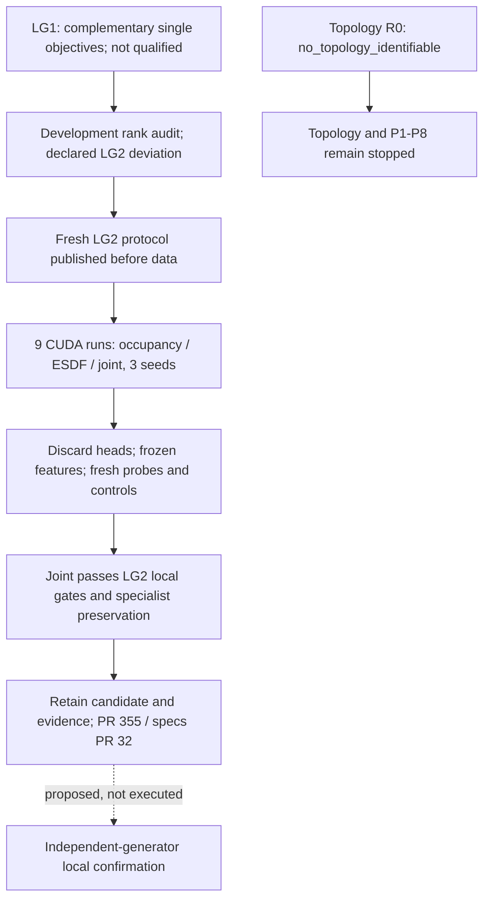

# LG2: joint pretraining preserves local specialist performance

Issue [#354](https://github.com/amadou-6e/theseo-anysearch/issues/354),
PR [#355](https://github.com/amadou-6e/theseo-anysearch/pull/355).
Disposition: **retain** the evidence and joint recipe for independent confirmation.
Do not promote to `develop`, certify a model, or advance topology/P1-P8.

## Completed result

**Nine CUDA encoder runs and their frozen-probe assessment completed in 444.5
seconds (7m24.5s).** The primary outcome is `joint_preserves_specialists`.
Joint pretraining satisfies every LG2 absolute, control, integrity and specialist-
preservation gate in the preregistered three-seed comparison. Single-objective
occupancy and ESDF remain `not_qualified` across all four tasks.

| Mean frozen-feature score across three seeds | Occupancy | ESDF | Joint |
| --- | ---: | ---: | ---: |
| Hidden occupied IoU, higher better | 0.9410 | 0.8699 | 0.9378 |
| Hidden exact boundary F1, higher better | 0.7890 | 0.7255 | 0.8225 |
| Observed-free clearance NMAE, lower better | 0.1820 | 0.0490 | 0.0491 |
| Hidden-free recovery NMAE, lower better | 0.1771 | 0.0479 | 0.0489 |

Means are descriptive, not substitutes for the per-seed gates:

| Joint metric | Seed 0 | Seed 1 | Seed 2 | Bar |
| --- | ---: | ---: | ---: | --- |
| Occupied IoU | 0.9436 | 0.9310 | 0.9387 | >=0.60 |
| Boundary F1 | 0.7516 | 0.8630 | 0.8528 | >=0.70 |
| Clearance NMAE | 0.0497 | 0.0491 | 0.0484 | <=0.15 |
| Recovery NMAE | 0.0491 | 0.0500 | 0.0476 | <=0.20 |

Occupancy-only fails clearance in all seeds (0.1749/0.1917/0.1793). ESDF-only
fails boundary F1 in seed 1 (0.6954). All 48 recipe/task/control comparisons
pass their frozen improvement and paired-geometry interval gates. Every encoder
has zero near-dead channels, unchanged frozen state and zero mask-isolation error.

## Specialist preservation

Positive improvement means higher classification score or lower regression error.
Every seed and the lower 95% paired geometry-bootstrap bound must remain above
the negative frozen margin. All four comparisons pass:

| Joint compared with | Metric | 95% mean-improvement interval | Allowed loss |
| --- | --- | --- | ---: |
| Occupancy-only | Occupied IoU | [-0.00979, +0.00388] | 0.03 |
| Occupancy-only | Boundary F1 | [+0.01461, +0.05295] | 0.03 |
| ESDF-only | Clearance NMAE | [-0.00159, +0.00133] | 0.02 |
| ESDF-only | Recovery NMAE | [-0.00245, +0.00040] | 0.02 |

Joint seed 0 loses 0.02433 boundary F1 versus occupancy-only but stays within
the 0.03 tolerance. This is not a claim that joint improves every seed or is
universally superior. Intervals are conditional on the three seeds; they do not
estimate seed-population uncertainty.

## Rank change is explicit

LG2 did **not** pass LG1's historical covariance-rank criterion. Joint rank
fractions are **0.17033, 0.16891, 0.17632**, all below 0.25. Its correlation-rank
fractions are 0.37966, 0.56789 and 0.52451. None of these are certification claims.

Before study data, the published development fixtures demonstrated that invertible
channel scaling reduced covariance rank from 0.9983 to 0.1259 without changing
held-out linear prediction accuracy; a useful rank-one representation also failed
0.25. Consequently LG2 preregistered covariance/correlation rank as diagnostics,
while retaining dead-channel, actual task, zero/shuffle, shuffled-label and state/
mask checks. No study feature whitening, post-hoc threshold change or LG1
reclassification was performed. LG1's `not_qualified` verdict remains unchanged.

## Interpretation and next boundary

Within this matched small-encoder study, **BCE + 10 * normalized ESDF Smooth L1**
is a candidate for learning surface and distance information together. It is the
recipe to take into independent local-geometry confirmation, not a demonstrated
optimal weighting, architecture or scaling rule. No tuning search was performed.

The raw visible-neighborhood diagnostic scores boundary F1 0.8243/0.8254/0.8322,
so joint is not uniformly better than direct local input on surface metrics.
Raw clearance/recovery errors are approximately 0.202-0.206, versus joint's
0.048-0.050. Raw has 81 input channels rather than eight and a different receptive
field; this is not a capacity-matched architecture comparison.

Recommended next boundary, **not executed here**: review this evidence, then freeze
an independent-generator local-geometry confirmation before larger-radius or
architecture comparisons. Do not interpret this result as lifting the topology
stop rule, validating a global latent, or authorizing a radius-512 run.

## Evidence and execution

- [Exact governing specification](https://github.com/amadou-6e/specs/blob/ee173bc2a61064386ee8669f77bad9ddf016b709/projects/theseo-anysearch/python/perception-encoder-local-geometry-lg2.md).
- Executable: `b230fab29bec8959267e20b9d3328f907bf901dc`.
- Pre-data publication: `af472eb` on `exp/354`.
- [Frozen registration](perception-encoder-local-geometry/lg2-preregistration.json):
  `7bf27e903a90bf1149c75dad80ea9dc88900e0e72e447957cd7ea1b32b393c25`.
- [Development rank fixtures](perception-encoder-local-geometry/lg2-rank-fixtures.json).
- [Full report](perception-encoder-local-geometry/lg2-report.json), payload SHA:
  `a1c99cf09adc3301dbd36307575e723a094c55a1335d996761a6cc5a1f3f135a`.

There are 96 pretraining, 48 probe-fitting and 48 evaluation geometries, disjoint
by fresh LG2 identity and balanced across 12 synthetic family/density strata.
Radius is eight, missingness independent Bernoulli(0.20), query count 256 per
geometry/task. All nine encoders finish before evaluation materialization.
Pretraining heads are discarded; only fresh probes evaluate frozen local features.

Execution: **9,216 encoder updates**, **61,440 probe updates** (120 fits including
controls). Encoder-training loops took 335.858 seconds. Total includes generation,
extraction, probes and assessment. PyTorch 2.13.0+cu126, RTX 3060 Ti, deterministic
FP32, TF32 disabled. Peak PyTorch CUDA allocation: 159,992,320 bytes, excluding
driver/context and other processes. A spot check showed 60% GPU utilization.
Updates and batches were matched; exact FLOP/time equality is not claimed.

Weights and tensor predictions are untracked in `runtime/local-geometry-lg2-run1/`.
The report records 18 artifact hashes, 192 corpus hashes, query hashes, curves,
all per-geometry sufficient statistics, controls and confidence intervals.

Validation: **333 garden tests passed**, including ten LG2 tests; development CUDA
joint forward/backward passed. Report and all 18 artifact hashes verified; full
assessment replay reproduced decisions/intervals. All 180 saved prediction/statistic
pairs agree (classification exactly; regression CPU/GPU reductions within rtol
1e-6, atol 1e-5). Source matches the frozen commit; LG1 code and report are untouched.

The user explicitly authorized stacking/execution before #353/specs#30 review.
No merges were performed. Results and specifications are published for review.
Evidence is synthetic, crop-local and within-generator, at one radius and three
seeds; no deployment, external-domain or topology qualification follows.

## State diagram

