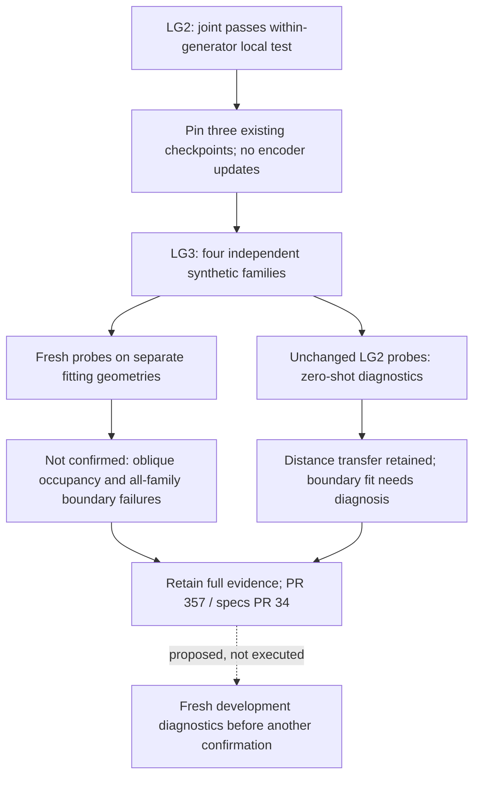

# LG3: independent-generator confirmation not achieved

Issue [#356](https://github.com/amadou-6e/theseo-anysearch/issues/356),
PR [#357](https://github.com/amadou-6e/theseo-anysearch/pull/357).
Disposition: **retain the evidence**, do not promote the encoder as broadly
confirmed. This completed experiment does not revoke LG2's narrower result.

## Result

LG3 completed in **42.829 seconds**, with **zero encoder updates**. The primary
outcome is **`not_confirmed`**. The exact three LG2 joint checkpoints were used,
with new probes fitted on independent-generator geometries and separate held-out
evaluation geometries. Old LG2 probes were also evaluated unchanged as zero-shot
diagnostics, not used to select the primary result.

| Metric | Newly fitted probe seeds 0 / 1 / 2 | Mean | Old-probe zero-shot mean |
| --- | --- | ---: | ---: |
| Occupied IoU | 0.6319 / 0.6325 / 0.6599 | 0.6414 | 0.6256 |
| Boundary F1 | 0.0000 / 0.5124 / 0.3963 | 0.3029 | 0.4620 |
| Clearance NMAE | 0.0512 / 0.0533 / 0.0531 | 0.0525 | 0.0556 |
| Recovery NMAE | 0.0516 / 0.0524 / 0.0523 | 0.0521 | 0.0554 |

Higher is better for IoU/F1, lower for NMAE. The primary path adapts probe weights
to the new domain; it is **not zero-shot transfer**. The old-probe column performs
no new fitting and retains the old normalizers.

## Where confirmation failed

All seeds pass pooled occupied IoU >=0.60, but the **oblique-sheet family fails**:
0.2425 / 0.3102 / 0.2700. Other family IoUs are approximately 0.70-0.90. The frozen
per-family gate therefore prevents the pooled average from hiding a substantial
surface-completion weakness.

Boundary F1 misses >=0.70 on **every family in every seed**:

| Family | Boundary F1 seeds 0 / 1 / 2 |
| --- | --- |
| Random field | 0.0000 / 0.6246 / 0.4586 |
| Oblique sheets | 0.0000 / 0.4149 / 0.4064 |
| Height field | 0.0000 / 0.5070 / 0.1644 |
| Curved tubes | 0.0000 / 0.5463 / 0.3775 |

Boundary also fails every control comparison's per-seed improvement requirement
because of seed 0. Mean bootstrap gains being positive does not override this.
All other pooled metric/control comparisons pass. Every family's clearance and
recovery errors pass the absolute bars in all seeds, ranging about 0.034-0.066.

**Integrity passed:** no encoder mutation, zero mask-isolation error and no dead
channels. Input checkpoints were hash-verified before data generation. Rank remains
diagnostic under the unchanged LG2 policy; no LG1 verdict was reclassified.

## What can and cannot be inferred

1. **Distance information transfers across these synthetic generators.** Both fresh
   and old probes yield similar clearance/recovery errors near 0.05-0.056. The raw
   neighborhood diagnostic errors are about 0.156-0.165. This is component-level
   evidence, not all-task qualification or a deployment guarantee.
2. **The surface result does not generalize sufficiently.** Oblique-sheet occupancy
   fails despite acceptable pooled IoU. Boundary quality is below the frozen bar
   throughout the new family set. LG2's within-generator success cannot be treated
   as broad local-geometry confirmation.
3. **Do not attribute all failure to the encoder.** Fresh boundary probes perform
   worse on average than the unchanged LG2 probes. Seed 0 makes only two positive
   boundary predictions, both incorrect, against 1,241 true boundary queries.
   Raw-neighborhood boundary F1 is also only 0.4721/0.4944/0.4965. These observations
   warrant checking probe optimization and task difficulty, not declaring total
   representational collapse or an established causal explanation.

Proposed next diagnostic, **not executed**: on separately identified development
geometry, distinguish thin-sheet sampling/aliasing and masked-target ambiguity
from probe-fit limitations and encoder limitations. A fixed-budget supervised
reference and probe-fitting diagnostics would help separate them. Any follow-up
confirmation needs fresh preregistration/evaluation identities; do not tune on LG3
evaluation or drop its failing families. Do not scale architecture or radius yet.

## Evidence and provenance

- [Frozen LG3 specification](https://github.com/amadou-6e/specs/blob/082f5b7e8979fe8e9fdf840087fa93df7c430dc2/projects/theseo-anysearch/python/perception-encoder-local-geometry-lg3.md).
- Executable: `21d1ea2c8f03d7def5dc5619d36d1dae5cdf2b9f`.
- Pre-data publication: `b465dc4` on `exp/356`.
- [Checkpoint and registration manifest](perception-encoder-local-geometry/lg3-preregistration.json):
  `722f883c542eb74af862b68d067d92c6fbaa860f205fbcb14bffee5b3bc055ee`.
- [Full report](perception-encoder-local-geometry/lg3-report.json), payload SHA:
  `4ecc543fbb3cbc9fceb27be871faa6ba94a29f99778066789a2667031acb6364`.

There are 48 fitting and 48 evaluation geometries, balanced over four independently
implemented procedural families crossed with three occupancy fractions. These are
smooth random fields, oblique sinusoidal sheets, height fields and curved tubes,
not real external data. Density is controlled by empirical quantiles. The fixed
17-cubed native lattice, 20% independent missingness and query algorithm remain
unchanged. Mask streams are deliberately reused to hold corruption constant;
complete geometry/target/query identities are new.

Execution: 48 probe fits, **24,576 probe updates**, zero encoder updates; three
additional old-probe inference passes. PyTorch 2.13.0+cu126 on RTX 3060 Ti,
deterministic FP32, TF32 disabled. Weights/predictions remain outside Git in
`runtime/local-geometry-lg2-run1/` (source checkpoints) and
`runtime/local-geometry-lg3-run1/` (new prediction/probe artifacts).

Validation: **343 garden tests passed**. Six source artifact hashes and loaded
encoder-state hashes verified before data. Report and six output artifact hashes
verified; full assessment replay identical; **72 prediction/statistic pairs**
checked, including zero-shot (classification exact, regression rtol1e-6/atol1e-5).
Frozen source and gates were not changed after data generation.

The user explicitly authorized stacked execution before prerequisite merges. No
PRs were merged. The report includes all geometry statistics, family scores,
controls, zero-shot diagnostics, bootstrap intervals and artifact identities.
No topology, planning, global-latent, realistic-occlusion or scale claim follows.

## State diagram

