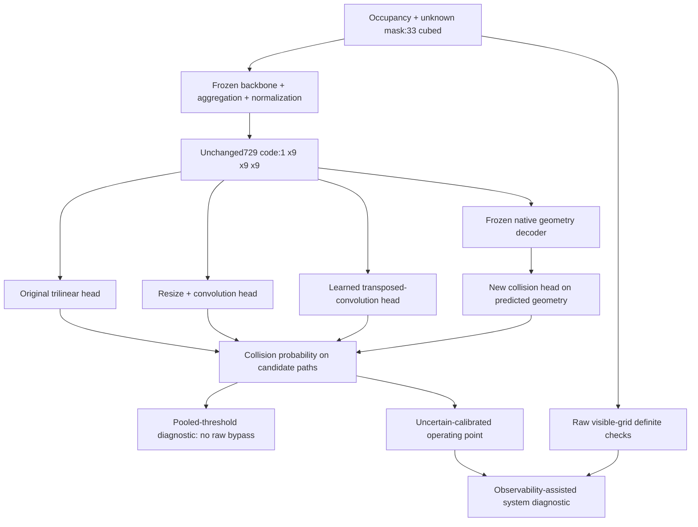

# Frozen collision readout assessment

Issue407 / PR408; specs80 / PR81. Authorized unmerged successor to405, not a
promotion or replacement for the original reports. Input33, central17, unchanged
729-number code. All encoder, normalization and native geometry-decoder weights
are frozen; only the new collision heads train.

## Frozen identities

- Protocol: `4961f46d4023d9780a9ffd0db18db2bf5e29e09c`, specs repository,
  `projects/theseo-anysearch/python/perception-encoder-collision-readout.md`.
- Implementation: `958b541`; frozen manifest commit `84436a7`.
- Run: `compact-collision-readout-v1-run1`.
- Package manifest: `2ddf188ecedff4699dba434fec05a851c5649119c07dcf30c9d9afd1292d4ed1`.
- Runtime: `runtime/compact-collision-readout-v1-run1`.
- Fresh data: `runtime/compact-collision-readout-v1-inputs`.

## What changes

Raw and full frozen spatial-feature heads are separate controls, not inputs to
the compact heads. Resize-convolution and transposed-convolution have exactly6257
trainable parameters each; original4521, native4953, raw4737, spatial6033. Native
also uses the pretrained frozen geometry decoder, whose parameter count is
reported separately. A null6257-parameter head shares resize-convolution's
initialization and trains on zero normalized codes.

The native zero-code ablation decodes a zero normalized code through the frozen
decoder. It does not set occupancy/boundary/distance predictions to zero. Shuffling
the independent decoder's outputs is equivalent to shuffling its input codes.

## Experimental boundary

Twenty-one fits: seven heads for each packaged seed401/402/403,4096 updates each,
32 geometries x4 sampled paths. Same initialization/sampling seed offsets and
AdamW schedule as405; no HPO, early stopping, or OOD winner selection. Fresh
train1536/calibration768/ID768/OOD576 geometries,32 short paths each, with parent
overlap rejected against all eight predecessor datasets and across new splits.

All42 calibration thresholds lock before test prediction access. Pooled and
uncertain-only95%-recall thresholds are kept distinct. The uncertain subset has
unknown path voxels but no visible occupied voxel. Ranking/log-loss metrics do
not change when a threshold changes. Empirical calibration recall is not a
population guarantee, and low pooled miss rates do not establish hidden-space safety.

The observability-assisted diagnostic needs raw visibility information to route
definite cases and unresolved cases. It is not a pure729-code interface. With
noiseless observed occupancy, the visible-grid rule can answer definite paths
exactly, but cannot resolve every hidden completion. This study does not test
sensor noise, contiguous missing slabs, larger fields, finite-body collision,
continuous swept volumes, global reachability or navigation performance.

The three OOD generator types were already inspected in405. Geometry instances
are fresh and outside head training, but the generator families are not untouched
by the research process. All seeds share one fresh corpus and one frozen backbone.

## Results

All21 fits and90 locked test prediction groups completed. All three revised
heads pass the preregistered ID improvement screen on all three seeds. None
passes competitiveness against raw-grid and spatial controls. Disposition: retain;
no promotion or deployment qualification.

Ranges below span seeds401/402/403, not confidence intervals. AP is uncertain-path
average precision; miss and false alarm use the uncertain-calibrated threshold.

| Head | ID AP | OOD AP | ID miss | ID false alarm |
| --- | --- | --- | --- | --- |
| Original | .476-.512 | .498-.507 | 3.4-4.8% | 18.5-20.5% |
| Resize + convolution | .606-.648 | .557-.609 | 3.8-4.4% | 14.2-15.4% |
| Transposed convolution | .572-.588 | .534-.566 | 4.0-5.4% | 14.2-16.1% |
| Frozen native decoder + head | .642-.676 | .581-.620 | 3.8-6.2% | 9.6-11.3% |
| Raw-grid control | .721-.753 | .638-.685 | 3.0-4.2% | 12.5-15.3% |
| Spatial-feature control | .763-.774 | .737-.749 | 2.6-5.2% | 11.1-13.8% |
| Null control | .048-.049 | .041-.043 | 5.4-7.6% | 94.4-95.9% |

The primary comparison is paired, geometry-weighted negative uncertain log loss,
not the path-weighted log loss in diagnostic metric tables. Its95% stratified
bootstrap intervals against the original head are positive for every ID seed:

| Head | Seed401 | Seed402 | Seed403 |
| --- | --- | --- | --- |
| Resize + convolution | [.0225,.0364] | [.0202,.0343] | [.0229,.0373] |
| Transposed convolution | [.0147,.0288] | [.0156,.0296] | [.0135,.0277] |
| Native decoder + head | [.0281,.0443] | [.0446,.0623] | [.0337,.0498] |

These are individual comparison intervals, not simultaneous family-wise bounds.
ID contains9731 uncertain paths,499 collisions; OOD contains7667,338 collisions.
Every ID geometry contributes eligible queries. All candidate seeds also exceed
the required .03 uncertain AP improvement and satisfy the empirical ID operating
limits of10% miss and25% false alarm. Those limits are screening criteria, not
safety guarantees. Native OOD miss rises to7.4-8.3% despite lower false alarms.

The pooled threshold misses11.4-12.4% of native-head uncertain collisions on ID,
versus3.8-6.2% with uncertain-only calibration. Raw-grid pooled thresholds miss
45.3-51.7% of uncertain collisions despite excellent overall ranking; uncertain
calibration reduces that to3.0-4.2%, with12.5-15.3% false alarms. This is a changed
operating point, not improved ranking or a new encoder. Comparisons of head
quality must keep this distinction explicit.

The practical direction is to keep the729 code and small field fixed and retain
geometry-aware readouts: native decoder reuse and resize-convolution refinement.
Native is strongest descriptively here; there is no preregistered native-versus-
resize superiority test or OOD-based winner selection. Equal parameter counts
make resize-versus-transpose informative, but do not prove an architectural law.
The native path uses additional frozen pretrained computation, so trainable-head
parameter counts alone are not an end-to-end efficiency comparison.

This resolves the bounded readout experiment. Further qualification needs a fresh
protocol and data for the retained path, including the previously observed noise
and contiguous-mask weaknesses; it must not tune on these locked tests or widen
the field prematurely. The earlier robustness failures remain in force.

Report payload: `1a2ff1ff8e87667720a00d3b6d6f55db69dcadba7fd0e709112baca1a0cdb921`.
Full metrics, all perturbation controls, thresholds and72 paired comparisons are
in [the report](compact-collision-readout-report.json).

## Validation

575 local garden tests pass. All seven head formats passed deterministic CUDA
forward/backward profiling; published CI was green at84436a7. The standalone
`scripts.verify_collision_readout` checks datasets, queries, package/cache states,
native decoder outputs, all head checkpoints and predictions, thresholds, metrics,
paired comparisons and assessment. Replay passed:314 artifacts,21 heads,
111 calibration/test prediction groups,684 encoder batches,116736 queries and
three frozen native decoders;128.953 seconds. See
[verification](compact-collision-readout-verification.json).

The study charged3102.907 seconds including its1200-second validation reserve.
Campaign usage is12.245490 of48 authorized GPU-hours, with35.754510 remaining.
No training process remains active. Weights and generated data remain runtime-only.
