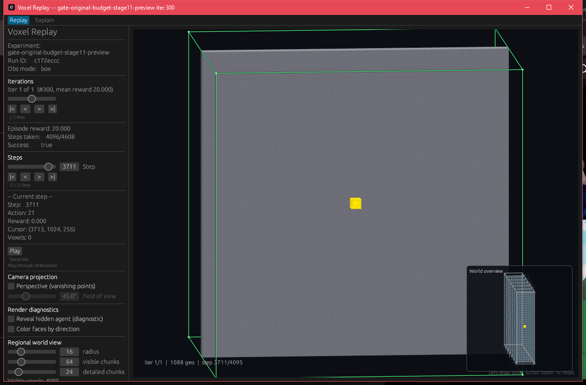
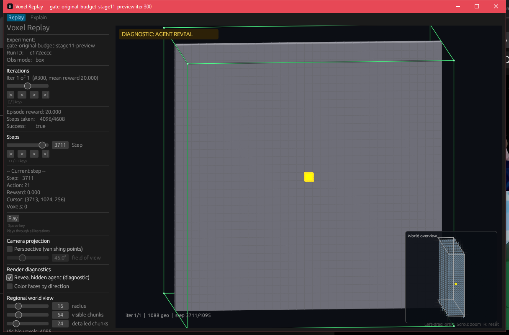
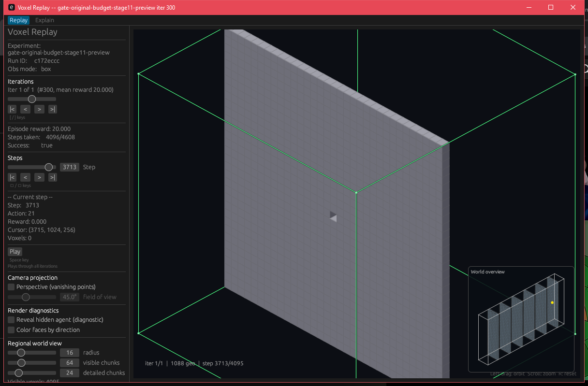
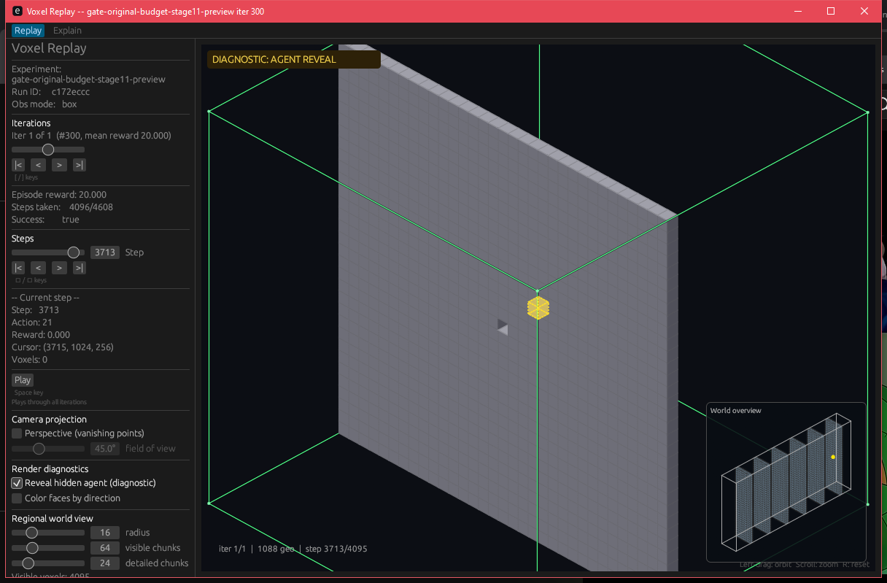

# Large-world replay agent visibility (#428)

The frozen stage-11 trajectory from [PR #410](https://github.com/amadou-6e/theseo-anysearch/pull/410) crosses the final single-voxel gate at X=3712. The original replayer shifted cursor coordinates by one storage voxel and painted all geometry after the agent. It could therefore hide the agent even when the wall was behind it. [before.png](before.png) is the unedited original failure.

The fixed replayer always uses physical depth ordering. Its agent is a filled yellow voxel. **Show trail** is offered only for non-compiled trajectories with trail data; this compiled-world trajectory has no trail and the control is absent in all four screenshots. **Reveal hidden agent (diagnostic)** is a separate, unchecked-by-default control. When checked, it adds a translucent dashed outline through geometry and a conspicuous viewport badge. It does not change normal rendering or wall opacity.

| Camera relationship | Diagnostic unchecked (normal) | Diagnostic checked |
| --- | --- | --- |
| Agent in front of wall; step 3711, cursor `(3713,1024,256)` |  |  |
| Wall in front of agent; step 3713, cursor `(3715,1024,256)` |  |  |

These are actual Windows GUI captures, not illustrations. In the fixed 81×81-pixel region around the agent, the four states respectively contain **523**, **561**, **0**, and **257** yellow pixels. The checked states both contain the diagnostic badge; the unchecked states do not. The wall-front normal frame leaves the final gate aperture visible but hides the agent completely: **zero strong or muted yellow pixels** remain in that region. Opaque wall-face edges seal anti-aliased tile seams while a separate subtle grid remains visible. See [capture.json](capture.json) for hashes, exact source and trajectory identities, and measured counts. Three unit tests cover when the trail control is offered; the full `theseo-core` test suite passes.

To reproduce on Windows at 100% display scaling, build the replayer from source commit `c422b17a1d122596e1ce7a6d1b82d5aeaa1e02d8` or later. Run both views against the frozen PR #410 trajectory:

```powershell
cargo build --manifest-path theseo_anysearch/core/Cargo.toml --bin voxel-replay --offline
powershell -NoProfile -ExecutionPolicy Bypass -File usage/experiments/replay_visibility_428/capture.ps1 -View AgentFront -Trajectory C:\path\to\iter_000300.json
powershell -NoProfile -ExecutionPolicy Bypass -File usage/experiments/replay_visibility_428/capture.ps1 -View WallFront -Trajectory C:\path\to\iter_000300.json
```

The script requires trajectory SHA-256 `FDA5337188B31AD10A50F0218B7C597DD555710F3B65D213EE9288D02DFB221A` and its companion compiled world pack. It opens a fresh 1216×799 replay, selects the fixed step and camera, captures both checkbox states, and writes PNGs plus a manifest under ignored `runtime/replay-visibility-428/`. It fails if the normal frame contradicts the expected wall/agent ordering or if the diagnostic badge is missing.

Governing perception-encoder specs are pinned at [`a94227bc4ee484287a026f89ec6cd47d5ca16d26`](https://github.com/amadou-6e/specs/tree/a94227bc4ee484287a026f89ec6cd47d5ca16d26/projects/theseo-anysearch/python).
