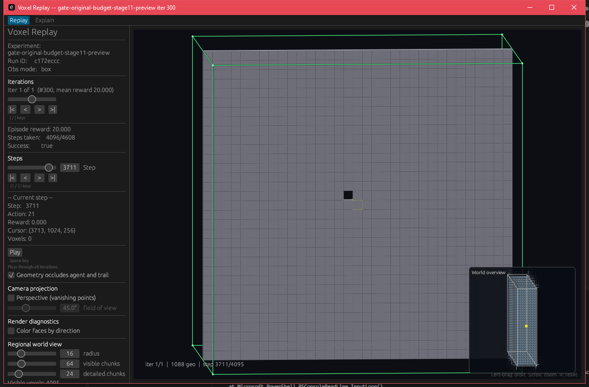
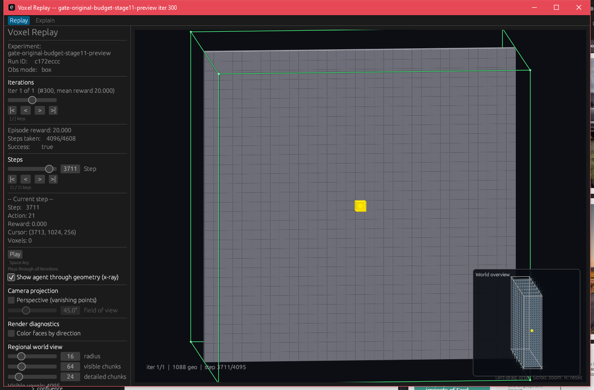

# Stage-11 agent visibility regression (#428)

The frozen stage-11 large-world trajectory from [PR #410](https://github.com/amadou-6e/theseo-anysearch/pull/410) has a successful 4096-step episode. At step **3711**, the cursor is `(3713, 1024, 256)`, one voxel beyond the final gate wall at X=3712. The old replay converted this cursor to storage `(3712, 1023, 255)` and painted all wall geometry over the agent. The training environment's `WorldState::storage` uses the recorded coordinates directly, so the replay conversion was incorrect.

| Original replay, normal depth | Fixed replay, normal depth | Fixed replay, x-ray |
| --- | --- | --- |
|  |  |  |

The measured 81×81-pixel region around the gate contains **0** yellow pixels in the original normal-depth frame, **528** in the fixed normal-depth frame, and **528** with x-ray enabled. The fixed screenshot is an actual Windows GUI capture, not a synthetic illustration. The normal-depth box is unchecked in `after.png`.

To reproduce on Windows at 100% display scaling, build the replayer from source commit `e5fff890b620827ce86e65838a3024f522335f21` or later, then run:

```powershell
cargo build --manifest-path theseo_anysearch/core/Cargo.toml --bin voxel-replay --offline
powershell -NoProfile -ExecutionPolicy Bypass -File usage/experiments/replay_visibility_428/capture.ps1 -Trajectory C:\path\to\iter_000300.json
```

The trajectory must be the frozen PR #410 fixture with SHA-256 `FDA5337188B31AD10A50F0218B7C597DD555710F3B65D213EE9288D02DFB221A`; its companion compiled world pack must remain alongside it as recorded in that trajectory. The script validates the hash and cursor, opens a fresh replay process, sets a 1216×799 window, enters step 3711, orbits toward the X wall, zooms five notches, and captures normal and x-ray frames. It writes PNGs and a hash/measurement manifest to ignored `runtime/replay-visibility-428/`. It fails if the normal-depth agent is not visible or differs in yellow-pixel count from x-ray.

The published fixed-frame hashes and source identity are in [capture.json](capture.json). Governing perception-encoder specs are pinned at [`a94227bc4ee484287a026f89ec6cd47d5ca16d26`](https://github.com/amadou-6e/specs/tree/a94227bc4ee484287a026f89ec6cd47d5ca16d26/projects/theseo-anysearch/python).
