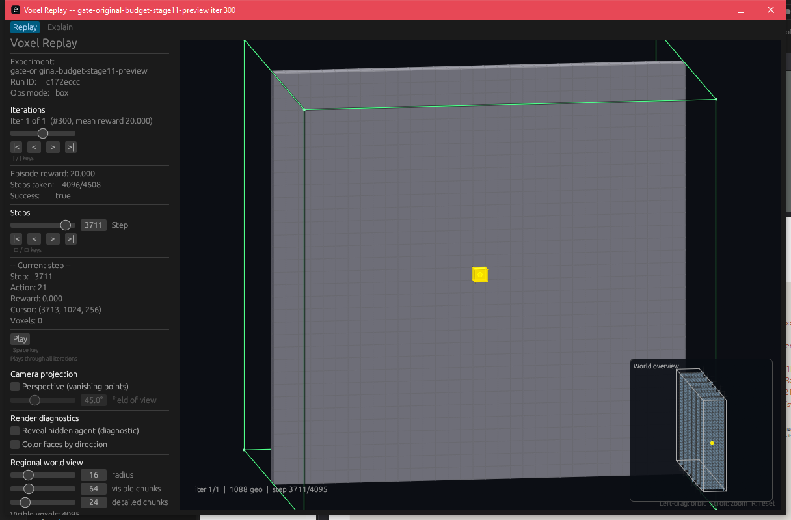
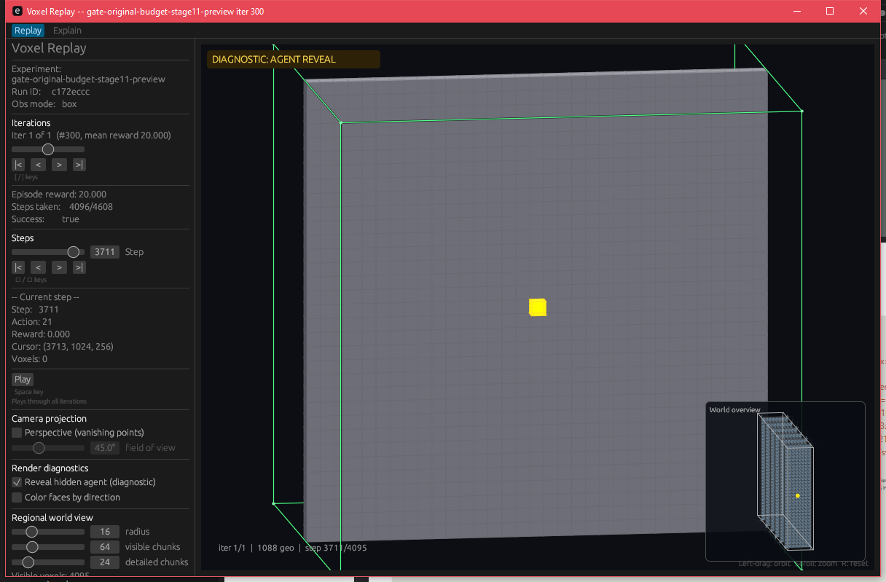
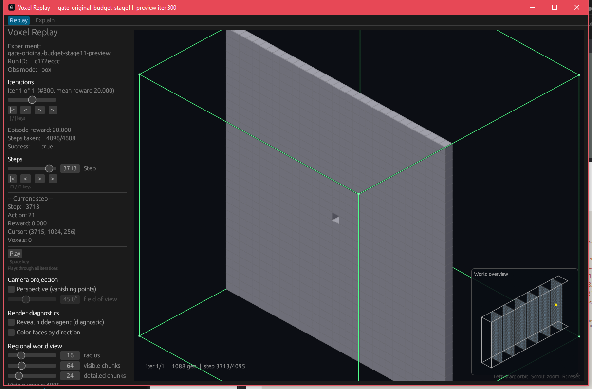
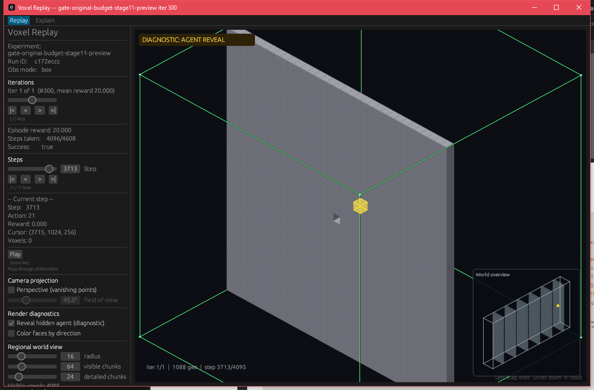

# Develop-line replay visibility proof (#433)

This is a fresh capture from the `develop/433` promotion build, not a reuse of the experimental screenshots. It promotes the accepted replay alignment foundation `b095a6d` (issue #315) and agent-visibility fix `fde6f11` (issue #428, PR #431) without merging the experimental integration branch. The exact code HEAD used for this capture is `da724a665bda398f1f19a4c1e1f6329ef3352ca6`; the binary and frozen trajectory hashes are in [capture.json](capture.json).

The stage-11 trajectory crosses the final wall at X=3712. At step 3711, the agent is in front of the wall; at step 3713, the wall is in front of the agent. The cursor is a filled voxel when visible. The wall remains opaque normally, while the separately enabled diagnostic mode marks the hidden agent with a dashed yellow overlay and a conspicuous badge. The compiled-world trajectory has no trail, so **Show trail** is absent in all four views.

| Camera relationship | Diagnostic unchecked | Diagnostic checked |
| --- | --- | --- |
| Agent in front of wall |  |  |
| Wall in front of agent |  |  |

The four captures contain 555, 563, 0, and 257 strong yellow pixels respectively in the fixed 81×81 agent region; the wall-front normal frame also has zero muted yellow pixels. Both diagnostic frames have the badge, and neither normal frame does. All four captures passed the script's assertions, and the OS pointer was parked outside the window before each screenshot. The original failure remains documented in [the source experiment's before.png](../replay_visibility_428/before.png).

To reproduce on Windows at 100% display scaling, build `voxel-replay` from code commit `da724a6` or later and run the original [capture script](../replay_visibility_428/capture.ps1) against a local copy of the frozen PR #410 `iter_000300.json` trajectory. The script verifies trajectory SHA-256 `FDA5337188B31AD10A50F0218B7C597DD555710F3B65D213EE9288D02DFB221A`, opens the replayer, and writes two views with normal and diagnostic frames under ignored `runtime/replay-visibility-428/`. Its output manifests supplied the hashes and pixel counts in [capture.json](capture.json).

Validation: `cargo test -q --manifest-path theseo_anysearch/core/Cargo.toml --offline` passed on this promotion branch, including 195 core tests and 20 replayer tests.

Governing perception-encoder specs are pinned at [`a94227bc4ee484287a026f89ec6cd47d5ca16d26`](https://github.com/amadou-6e/specs/tree/a94227bc4ee484287a026f89ec6cd47d5ca16d26/projects/theseo-anysearch/python).
